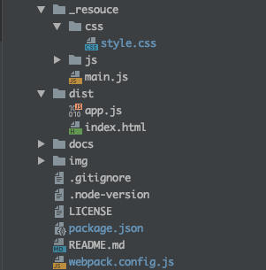

# turfjs-starter


Start Turf.js easily.  
- [Turf.js v6.3.0](http://turfjs.org/)  
- [MapboxGLJS v1.13.0](https://www.mapbox.com/mapbox-gl-js/api/)  
- [webpack v5.11.1](https://webpack.js.org)  
- node v15.5.0
- npm v7.3.0

<br>

## Usage



<br>

Install package
```bash
npm install
```

<br>

build
```bash
npm run build
```

<br>

dev
```bash
npm run dev
```

---

<br>
<br>


<br>

## License
MIT

Copyright (c) 2019-2021 Yasunori Kirimoto

<br>

---

<br>

### Japanese

<br>

# Turf.js スターター


Turf.jsを手軽に始める
- [Turf.js v6.3.0](http://turfjs.org/)  
- [MapboxGLJS v1.13.0](https://www.mapbox.com/mapbox-gl-js/api/) 
- [webpack v5.11.1](https://webpack.js.org)  
- node v15.5.0
- npm v7.3.0

<br>

##  使用方法


<br>

パッケージインストール

```bash
npm install
```

<br>

ビルド

```bash
npm run build
```

<br>

開発

```bash
npm run dev
```

<br>
<br>


<br>

## ライセンス
MIT

Copyright (c) 2019-2021 Yasunori Kirimoto

<br>
