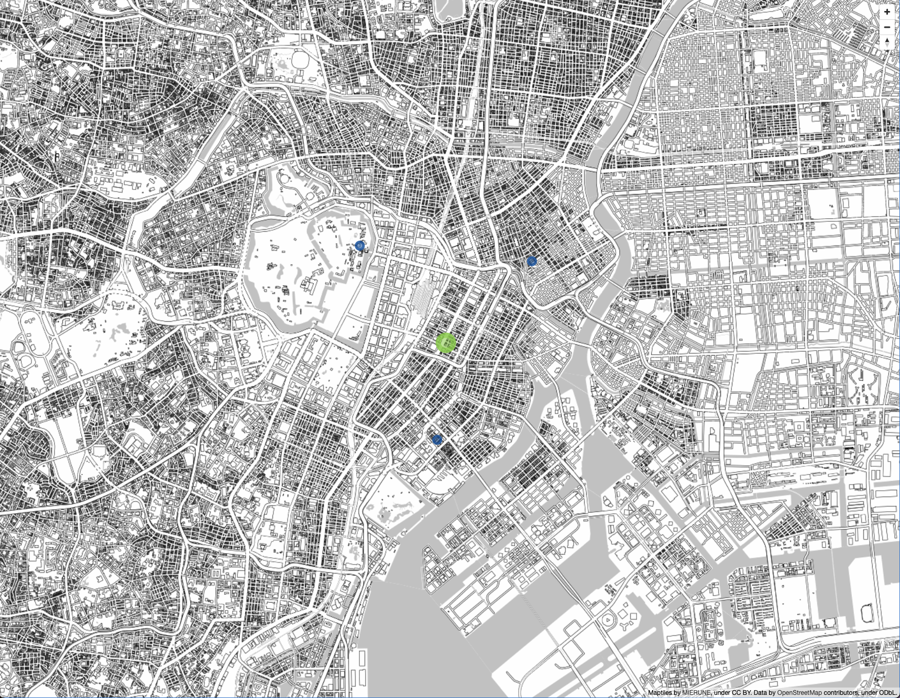

# maplibregljs-turf-starter


Start Turf.js easily.  
- [Turf.js v7.3.1](http://turfjs.org/)  
- [MapLibre GL JS v5.15.0](https://maplibre.org)  
- [TypeScript v5.9.3](https://www.typescriptlang.org)  
- [Vite v7.3.1](https://vitejs.dev)  
- node v24.4.1
- npm v11.4.2

<br>

## Usage


<br>

Install package
```bash
npm install
```

<br>

build
```bash
npm run build
```

<br>

dev
```bash
npm run dev
```

---

<br>
<br>



<br>

## License
MIT

Copyright (c) 2023-2026 MapLibre User Group Japan

<br>

---

<br>

### Japanese

<br>

# MapLibre GL JS & Turf.js スターター


Turf.jsを手軽に始める
- [Turf.js v7.3.1](http://turfjs.org/)  
- [MapLibre GL JS v5.15.0](https://maplibre.org)  
- [TypeScript v5.9.3](https://www.typescriptlang.org)  
- [Vite v7.3.1](https://vitejs.dev)  
- node v24.4.1
- npm v11.4.2

<br>

##  使用方法


<br>

パッケージインストール

```bash
npm install
```

<br>

ビルド

```bash
npm run build
```

<br>

開発

```bash
npm run dev
```

<br>
<br>


<br>

## ライセンス
MIT

Copyright (c) 2023-2026 MapLibre User Group Japan

<br>
